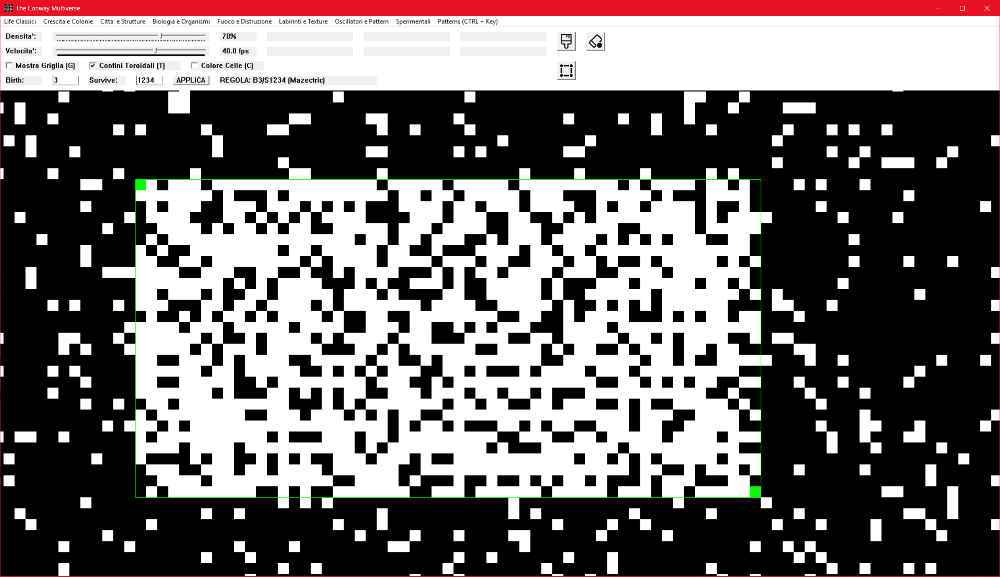
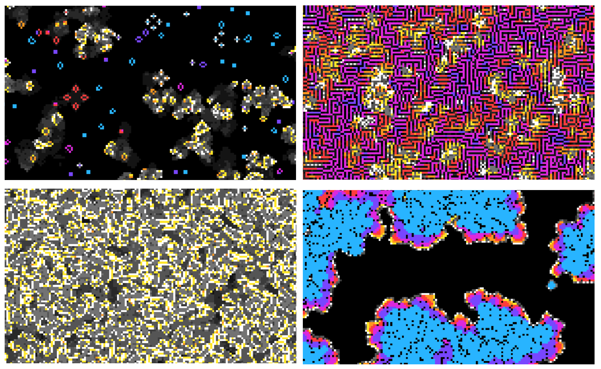
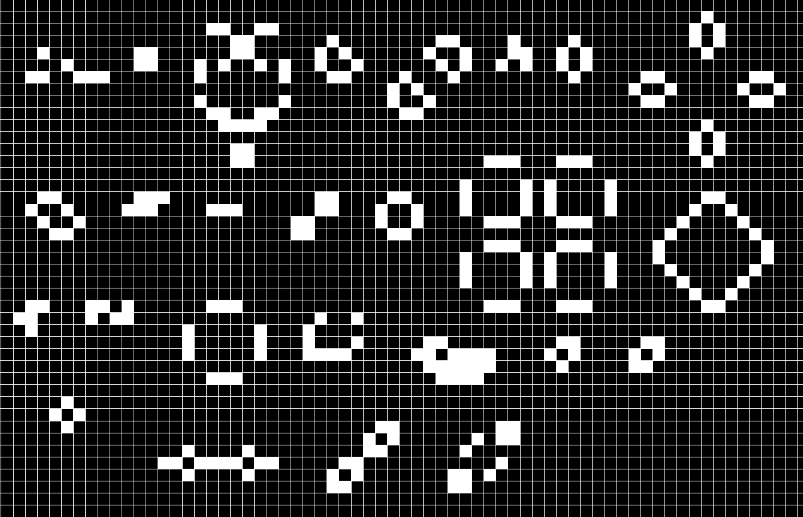

# The Conway Multiverse
 
Un simulatore di automi cellulari (Game of Life e varianti) per Windows, scritto in C++20 puro con Win32 API, senza framework esterni.

## Screenshot


*Vista d'insieme dell'interfaccia: griglia, controlli e barra degli strumenti.*


*La simulazione in esecuzione, con l'evoluzione delle celle generazione dopo generazione.*


*Confronto tra quattro regole diverse, con colorazione per età: Conway's Game of Life (in alto a sinistra), Flammable Wire Casing (in alto a destra), A World On Fire (in basso a sinistra), Coral (in basso a destra).*


*I pattern predefiniti disponibili nella libreria, incollabili direttamente sulla griglia.*

## Caratteristiche
 
- **~70 regole predefinite** organizzate in 8 categorie tematiche (Life Classici, Crescita e Colonie, Città e Strutture, Biologia e Organismi, Fuoco e Distruzione, Labirinti e Texture, Oscillatori e Pattern, Sperimentali), selezionabili dal menu.
- **Regole B/S personalizzate**: è possibile digitare Birth e Survive a piacere (campi di testo + pulsante APPLICA), con validazione dell'input.
- **Griglia 512x512** con bordi **toroidali** o "morti" (configurabili a runtime).
- **Colorazione per età**: ogni cella mantiene un contatore di quanti turni è viva (o morta), usato per sfumare il colore da "appena nata" a "stabile/vecchia".
- **Undo/Redo**: buffer circolare di 30 stati (Ctrl+Z / Ctrl+Y).
- **Strumenti di disegno**: selezione rettangolare,  pennello, gomma (con interpolazione del tratto, che funziona poco per colpa di Windows).
- **Libreria di pattern**: Still Lives, Oscillators, Spaceships, Methuselahs (Block, Glider, Pulsar, Pentadecathlon, R-Pentomino, ecc.), incollabili con rotazione/specchiatura al volo.
- **Copia/incolla di selezioni personalizzate** (Ctrl+Shift+C / Ctrl+Shift+V).
- **Renderer software**: disegno diretto dei pixel su DIB section + BitBlt, nessuna libreria grafica esterna.
- **Modalità schermo intero** (F11), zoom e pan della griglia.
- Contatori live: FPS, generazione, celle vive/nate/medie/stabili.
## Requisiti
 
- Windows
- Compilatore con supporto **C++20**
- Librerie: `Windows.h`, `Windowsx.h`, `commctrl.h` (richiede il link a `Comctl32.lib`, già gestito via `#pragma comment`)
## Compilazione
 
Il progetto supporta due modalità:
 
Il progetto supporta due modalità:
 
- **Multi-file** (default): richiede `resource.h` e le risorse (icone) associate. Il file delle risorse deve includere: l'icona del programma (`IDI_ICON5`, usata come icona della finestra) e le icone dei pulsanti pennello/gomma/selezione nei rispettivi stati on/off (`IDI_ICON1-4`, `IDI_ICON6-7`).
- **Singolo file**: decommentare `#define ONE_FILE` in cima al sorgente. In questa modalità le icone dei pulsanti (pennello/gomma/selezione) non vengono caricate e i relativi `SendMessage(..., BM_SETIMAGE, ...)` vengono esclusi in compilazione: i pulsanti restano visibili ma senza icona.

```cpp
/// DECOMMENTA QUESTA RIGA SE USI UN SINGOLO FILE v v v v v
#define ONE_FILE  // <<<<<<<<<<<<<<<<<<<<<<<<<<<<<<<<<<
/// ^^^^^^^^^^^^^^^^^^^^^^^^^^^^^^^^^^^^^^^^^^^^^^^^^^^^^^^
```
 
## Controlli
 
### Mouse
| Azione | Effetto |
|---|---|
| Click sinistro (senza strumenti attivi) | Seleziona la cella corrente / trascina per muovere la griglia |
| Rotellina | Zoom in/out |
| Pennello/Gomma attivi + drag | Disegna/cancella un tratto continuo |
| Hover sullo strumento selezione | Mostra un tooltip nativo con le istruzioni d'uso ("click sulla prima cella del rettangolo, poi sull'ultima") |
 
### Tastiera
| Tasto | Effetto |
|---|---|
| `Invio` | Avvia/mette in pausa la simulazione |
| `+` / `-` | Aumenta/diminuisce la velocità |
| `Ctrl+Z` / `Ctrl+Y` | Undo / Redo |
| `Canc` / `Backspace` | Cancella l'area selezionata (o tutta la griglia) |
| `X` | Riempimento casuale (in base alla densità impostata) dell'area selezionata o dell'intera griglia |
| `W A S D` | Pan della vista |
| `G` | Mostra/nascondi griglia |
| `T` | Attiva/disattiva bordi toroidali |
| `C` | Attiva/disattiva colorazione delle celle |
| `R` | Reset zoom e posizione |
| `F11` | Schermo intero |
| `Ctrl + [lettera]` | Incolla il pattern associato (es. `Ctrl+G` = Glider) |
| `Ctrl+Shift+C` | Copia la selezione corrente come pattern |
| `Ctrl+Shift+V` | Incolla l'ultimo pattern copiato |
| `Shift` / `Alt` / `Ctrl` (durante un incolla) | Ruota di 90° / specchia su X / specchia su Y il pattern |
| `Spazio` | Conferma orientamento e termina l'incolla |
 
## Formato delle regole
 
Le regole seguono la notazione standard **B/S** (Birth/Survive), es. `B3/S23` per il Game of Life classico: nasce una cella morta con esattamente 3 vicini vivi, sopravvive una cella viva con 2 o 3 vicini vivi.
 
### Editor delle regole custom
 
I campi **Birth** e **Survive** accettano cifre da 0 a 8 in qualsiasi ordine e con eventuali duplicati (vengono normalizzate: ordinate e deduplicate automaticamente). Un input non numerico invalida l'intera regola e il pulsante APPLICA non ha effetto.
 
Dopo aver premuto APPLICA, la nuova regola viene confrontata con l'intera libreria predefinita: se corrisponde esattamente a una regola nota, l'etichetta mostra anche il suo nome (es. `B3/S23 (Conway's Game of Life)`); altrimenti viene mostrata solo la notazione B/S, senza nome.

## Struttura del codice
 
- **`DrawGrid`**: renderizza griglia e celle scrivendo direttamente nel buffer di pixel.
- **`ElabGrid`**: calcola la generazione successiva applicando le regole B/S correnti, gestendo i bordi (toroidali o morti) e aggiornando l'età delle celle.
- **`ClicCell` / `Qclick`**: gestiscono il disegno interattivo, incluso il tracciamento di rette per interpolare i tratti del pennello/gomma tra due posizioni del mouse.
- **`PastePattern`**: scrive un pattern (dalla libreria o copiato dall'utente) sulla griglia, applicando le trasformazioni di rotazione/specchiatura richieste.
- **`WindowProcessor3D`**: la window procedure che gestisce tutti i messaggi Win32 (mouse, tastiera, comandi dei controlli, paint, timer).
## Note
 
- La costante `GridSize` (512) definisce la dimensione della griglia; `TrackSize` (30) la profondità dell'undo/redo.
- I colori delle celle in base all'età sono definiti nell'array `AgeColor` (formato BGR).
- **Nessun salvataggio su disco**: al momento lo stato della griglia esiste solo in memoria e si perde alla chiusura del programma (a parte l'undo/redo, limitato a 30 generazioni). Il salvataggio/caricamento su file è previsto come sviluppo futuro.

## Sviluppi futuri
 
- [ ] Salvataggio e caricamento della griglia su file (es. formato testuale o RLE compatibile con altri simulatori di Life).